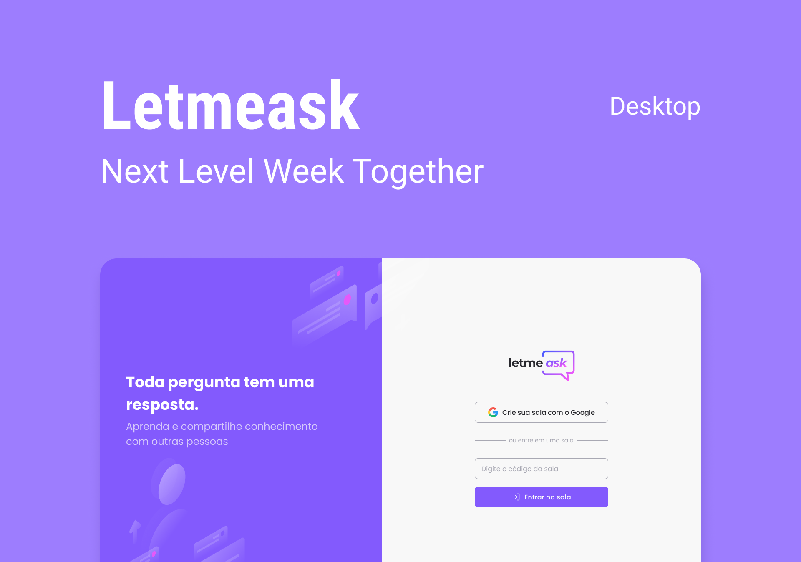

<p align="center">
  
</p>

<p align="center">
  

  

  
</p>

<br>

<h1 align="center">
    
</h1>

<br>

## 🧪 Tecnologias

Esse projeto foi desenvolvido com as seguintes tecnologias:

- [React](https://reactjs.org)
- [TypeScript](https://www.typescriptlang.org/)
- [Firebase](https://firebase.google.com/)
- [Shadcn/ui](https://ui.shadcn.com/)
- [Tailwind CSS](https://tailwindcss.com/)

## 🚀 Como executar

Clone o projeto e acesse a pasta do mesmo.

```bash
gh repo clone rudneyrodrigues/letmeask
```

```bash
cd letmeask
```

Para iniciá-lo, siga os passos abaixo:

```bash
# Instalar as dependências
pnpm i
```

```bash
# Iniciar projeto
pnpm dev
```

O app estará disponível no seu browser pelo endereço http://localhost:5173.

Lembrando que será necessário criar uma conta no [Firebase](https://firebase.google.com/) e um projeto para disponibilizar um Realtime Database.

## 💻 Projeto

Letmeask é perfeito para criadores de conteúdos poderem criar salas de Q&A com o seu público, de uma forma muito organizada e democrática.

## 🔖 Layout

Você pode visualizar o layout do projeto através do link abaixo:

- [Layout Web](https://www.figma.com/community/file/1009824839797878169/Letmeask)

Lembrando que você precisa ter uma conta no [Figma](http://figma.com/).

## License

[MIT](LICENSE) © [Rudney Rodrigues do Nascimento](https://rudneyrodrigues.dev.br)
