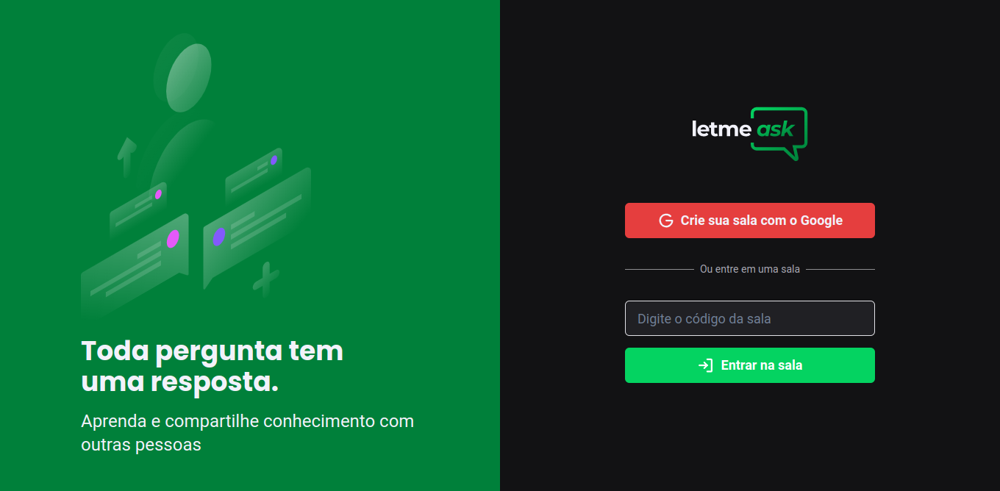

# **LETMEASK**



## 🌟 **Stack**

- [x] NextJS
- [x] Typescript
- [x] Styled-Components
- [x] Phosphor Icon
- [x] Firebase **(Realtime database)**
- [x] NextAuth **(Authenticate)**
- [x] React Hot Toast

## **Próximas atualizações**

- [ ] Framer Motion

## **Executando o projeto**

Clone o repositório com o comando:
```cl
git clone https://github.com/rudneyrodrigues/letmeask.git
```

Entre na pasta do projeto execute o comando abaixo para instalar as dependências:
```cl
yarn
```

Em seguida, execute o comando abaixo para iniciar o projeto:
```cl
yarn dev
```

Lembre-se de adicionar as Environments Variables no arquivo .env.local
```
# Firebase

NEXT_PUBLIC_FIREBASE_API_KEY=
NEXT_PUBLIC_FIREBASE_AUTH_DOMAIN=
NEXT_PUBLIC_FIREBASE_DATABASE_URL=
NEXT_PUBLIC_FIREBASE_PROJECT_ID=
NEXT_PUBLIC_FIREBASE_STORAGE_BUCKET=
NEXT_PUBLIC_FIREBASE_MESSAGING_SENDER_ID=
NEXT_PUBLIC_FIREBASE_APP_ID=

# NextAuth
GOOGLE_CLIENT_ID=
GOOGLE_CLIENT_SECRET=

NEXTAUTH_SECRET=
NEXTAUTH_URL=
```

## **Contato**

Siga-me para mais conteúdo.

<div style="display:flex; align-items:center; justify-content:center; gap:16px; margin-top: 24px;">


</div>
